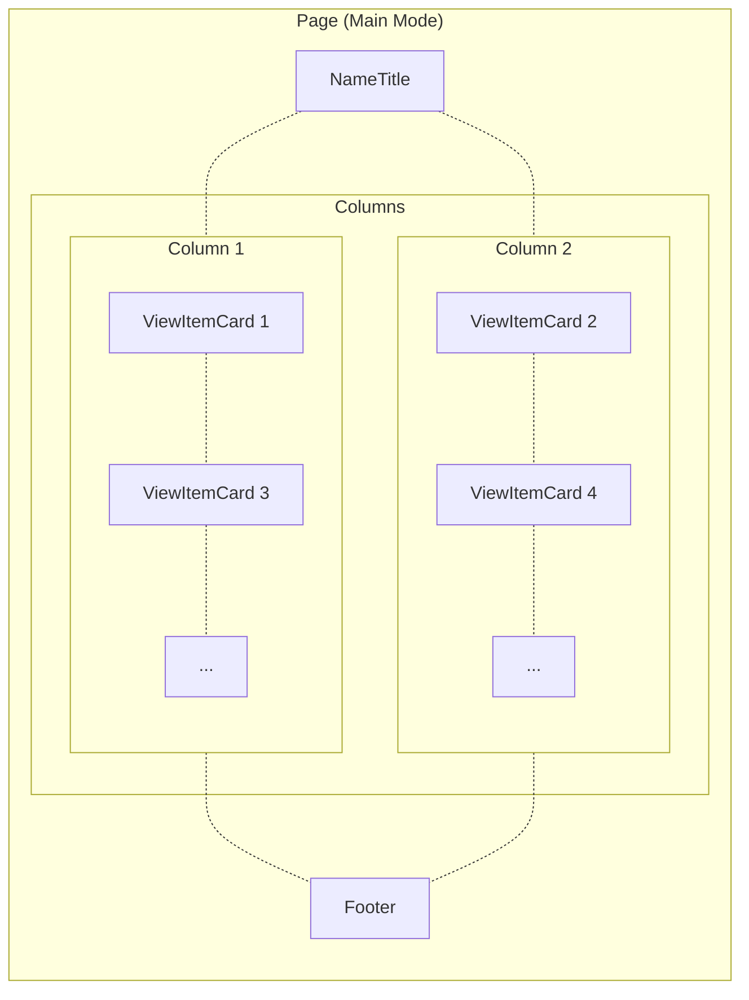
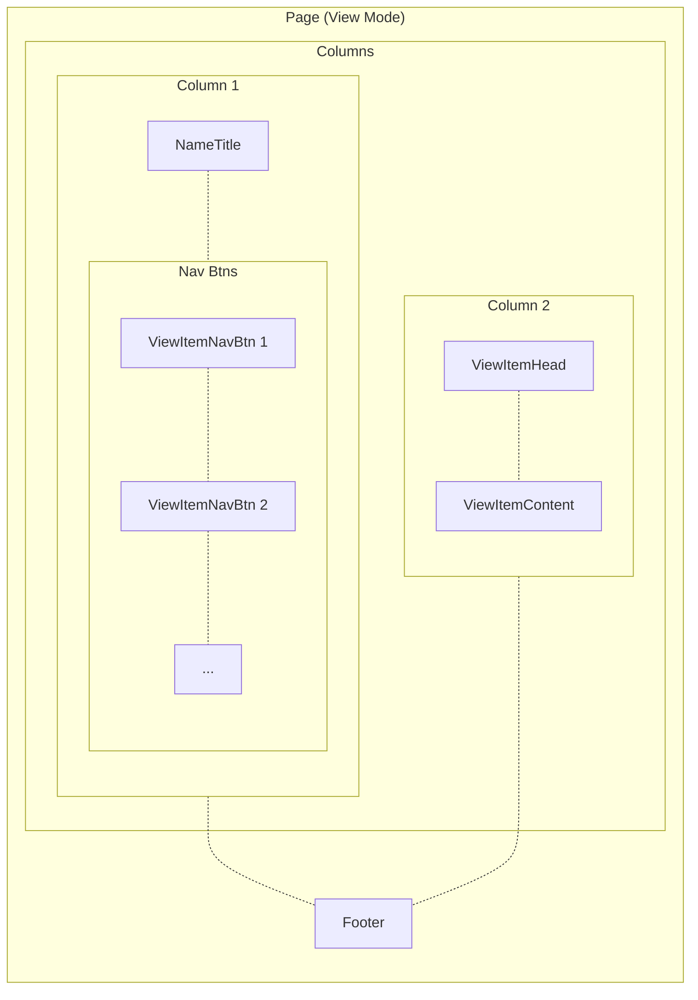

# Alan Wang's Github Homepage

[](https://github.com/alankrantas/alankrantas.github.io/actions/workflows/github-pages-deploy.yml)

👉 [**alankrantas.github.io**](https://alankrantas.github.io/)

---

## Overview

- A single page application (SPA) with working responsive web design (RWD).
- Built with [Svelte](https://svelte.dev/) (upgraded to Svelte 5 syntax), [SvelteKit](https://kit.svelte.dev/) and [Bootstrap](https://getbootstrap.com/) with [TypeScript](https://www.typescriptlang.org/) support.
- Deployed to [Github Pages](https://pages.github.com/) and run Dependabot PR test build using [Github Action](https://github.com/features/actions) workflows.

## Layout and view item components

The site switches between two layouts - "main" and "view".

### Main mode

Index page with large navigation cards.



By clicking the button on a view card, the app will switch to view mode that shows the corresponding content.

### View mode

Detail page with side navigation bar and content.



The viewer can click the nav bar buttons to switch the view content, or go back to the main mode.

The index page also accepts a `view` URL parameter to switch to a specific view (although it's still done in SPA - shallow routing - instead of using SvelteKit routing), which makes it useful to be linked elsewhere.

### Components

#### `/src/routes/`

| Page            | Function                                                |
| --------------- | ------------------------------------------------------- |
| `page.svelte`   | Main SPA page                                           |
| `error.svelte`  | Error page                                              |
| `layout.svelte` | Load CSS/fonts, set header tags and wrap error handling |

#### `/src/lib/components/`

| Folder             | Function                                              |
| ------------------ | ----------------------------------------------------- |
| `common`           | Components for general content purposes               |
| `site`             | Components for non-general nor non-viewitem functions |
| `viewitem`         | Components for displaying view item                   |
| `viewitem-content` | Components of the view item content                   |

### Responsive layouts

Each mode may have multiple layout and style adjustments based on different inner widths (`1200`, `992`, `768` and `576` px), utilizing one or multiple of the following approaches:

1. Svelte template syntax
2. Bootstrap classes
3. Vanilla CSS (`/src/css/custom.css`)

Both main and view mode will be squashed into a single column when the screen width becomes smaller than `992` px.

Some reusable components, like `Image` and `Showcase`, has properties to control the component responsive behavior under different inner widths.

## Add or modifying content

### Info, lists and works

This app is designed that most of the web content are stored as JSON files under `/src/lib/data/` and can be modified quickly.

| Folder  | Function                                            |
| ------- | --------------------------------------------------- |
| `info`  | Personal and view item information                  |
| `lists` | Content for `Career`, `Links` or other lists        |
| `works` | Content for `Portfolio` (either lists or showcases) |

Many fields of lists and showcases, like description, footnote and tooltip, as well as the `Image` footnote, support inline HTML tags. Note that `<a href="..."></a>` will be automatically applied Bootstrap classes.

### Images

Site images are stored under `/static/`:

| Folder     | Function                                                                                 |
| ---------- | ---------------------------------------------------------------------------------------- |
| `about-me` | Personal-related images (<= 800px in width)                                              |
| `main`     | Banner images for view items (should be 800x400 px)                                      |
| `website`  | Utility images for website, including thumbnail                                          |
| `work`     | Showcase work images; should be 800px in height (book covers) or width (Maker projects)) |

### Add a new view item (page)

To add a new "page" in the site:

1. Add a "view item" component under `/src/lib/components/viewitem-content`.
2. Add a 800x400 px JPEG image under `/static/main`.
3. Add an entry in `/src/lib/data/info/ViewItems.json` with correct component file name and image URL.

The site would use dynamic importing to take care the rest.

---

## Local Development

> Prerequisites: [Node.js](https://nodejs.org/), [Git](https://git-scm.com/) and [Docker](https://www.docker.com/). This repo can be opened in [DevContainer](https://containers.dev/)/[CodeSpace](https://github.com/features/codespaces) as well.

### Install Dependencies

Install Yarn:

```bash
npm i -g yarn@latest
```

> Windows users would need to grant permission for Yarn in PowerShell (as Administrator) with `Set-ExecutionPolicy -Scope CurrentUser -ExecutionPolicy Unrestricted`.

Then

```bash
git clone https://github.com/alankrantas/alankrantas.github.io.git
cd alankrantas.github.io
yarn
```

### List of Actions

| Command             | Description                                                    |
| ------------------- | -------------------------------------------------------------- |
| `yarn upgrade-all`  | Upgrade all NPM dependencies.                                  |
| `yarn start`        | Start a local dev server and open `http://localhost:3000`.     |
| `yarn check`        | Sync SvelteKit files. Run after installation and before build. |
| `yarn lint`         | Lint files.                                                    |
| `yarn format`       | Format and prettify files.                                     |
| `yarn build`        | Build a local production at `./build`.                         |
| `yarn serve`        | Serve the local production and open `http://localhost:8080`.   |
| `yarn pull`         | Pull commit histories from `main` branch.                      |
| `yarn push`         | Push changes to `main` branch.                                 |
| `yarn commit`       | `yarn pull` + `yarn format` + `yarn commit`                    |
| `yarn docker-build` | Build a Docker container image                                 |
| `yarn docker-run`   | Run the Docker container and open `http://localhost:8080`.     |
| `yarn docker-stop`  | Stop the Docker container.                                     |
| `yarn docker`       | `yarn docker-build` + `yarn docker-run`                        |

### Build Timestamp

The Docker build and Github CD Workflow will generate a timestamp under `/static/website/build.json` in the production, which will be read by footer component.

### Easter Egg

See what would happen if you try to access an invalid path. :)
