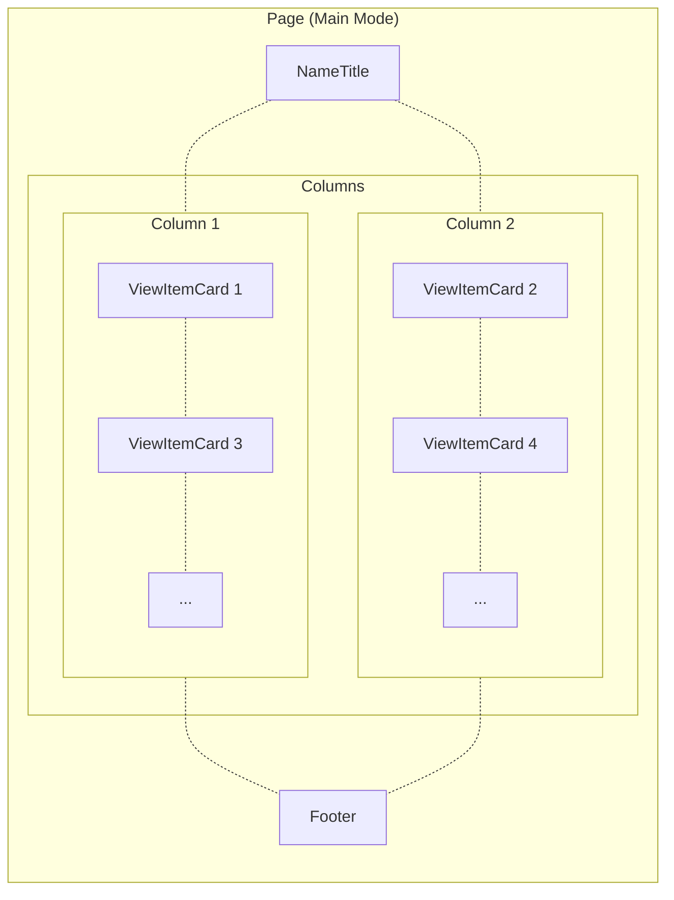
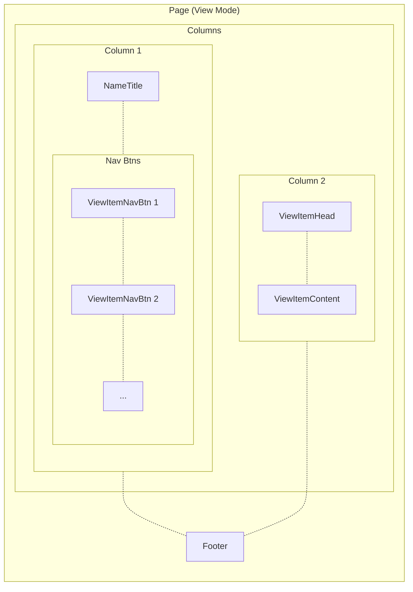

# Alan Wang's Github Homepage

[](https://github.com/alankrantas/alankrantas.github.io/actions/workflows/github-pages-deploy.yml)

👉 [**alankrantas.github.io**](https://alankrantas.github.io/)

---

## Overview

- A single page application (SPA) with working responsive web design (RWD).
- Built with [Svelte](https://svelte.dev/) (upgraded to Svelte 5 syntax), [SvelteKit](https://kit.svelte.dev/) and [Bootstrap](https://getbootstrap.com/).
- Deployed to [Github Pages](https://pages.github.com/) and run Dependabot PR test build using [Github Action](https://github.com/features/actions) workflows.

## Layout and View Components

The site switches between two layouts - "main" and "view".

### Main Mode

Index page with large navigation cards.



By clicking the button on a view card, the app will switch to view mode that shows the corresponding content.

### View Mode

Detail page with side navigation bar and content.



The viewer can click the nav bar buttons to switch the view content, or go back to the main mode.

The index page also accepts a `view` URL parameter to switch to a specific view directly (although it's still done in SPA instead of using SvelteKit routing), which makes it useful to be linked elsewhere.

### Responsive Layouts

Each mode may have multiple layout and style adjustments based on different inner widths (`1200`, `992`, `768` and `576` px), utilizing one or multiple of the following approaches:

1. Svelte template syntax
2. Pure CSS
3. Bootstrap classes

Both main and view mode will be squashed into a single column when the screen width becomes smaller than `992` px.

Some reusable components, like `Image` and `Showcase`, has properties to control the component responsive behavior under different inner widths.

## Add New View Content

To add a new "page" in the site:

1. Add an entry in `/src/lib/data/info/ViewItems.json` with correct component file name and image URL.
2. Add a "view item" component under `/src/lib/components/viewitem-content`.
3. Add a 800x400 px JPEG image under `/static/main`.

The rest will be taken care by the site itself.

---

## Local Development

> Prerequisites: [Node.js](https://nodejs.org/), [Git](https://git-scm.com/) and [Docker](https://www.docker.com/). This repo can be opened in [DevContainer](https://containers.dev/)/[CodeSpace](https://github.com/features/codespaces) as well.

### Install Dependencies

Install Yarn:

```bash
npm i -g yarn@latest
```

> Windows users would need to grant permission for Yarn in PowerShell (as Administrator) with `Set-ExecutionPolicy -Scope CurrentUser -ExecutionPolicy Unrestricted`.

Then

```bash
git clone https://github.com/alankrantas/alankrantas.github.io.git
cd alankrantas.github.io
yarn
```

### List of Actions

| Command             | Description                                                    |
| ------------------- | -------------------------------------------------------------- |
| `yarn upgrade-all`  | Upgrade all NPM dependencies.                                  |
| `yarn start`        | Start a local dev server and open `http://localhost:3000`.     |
| `yarn check`        | Sync SvelteKit files. Run after installation and before build. |
| `yarn lint`         | Lint files.                                                    |
| `yarn format`       | Format and prettify files.                                     |
| `yarn build`        | Build a local production at `./build`.                         |
| `yarn serve`        | Serve the local production and open `http://localhost:8080`.   |
| `yarn pull`         | Pull commit histories from `main` branch.                      |
| `yarn push`         | Push changes to `main` branch.                                 |
| `yarn commit`       | `yarn pull` + `yarn format` + `yarn commit`                    |
| `yarn docker-build` | Build a Docker container image                                 |
| `yarn docker-run`   | Run the Docker container and open `http://localhost:8080`.     |
| `yarn docker-stop`  | Stop the Docker container.                                     |
| `yarn docker`       | `yarn docker-build` + `yarn docker-run`                        |
